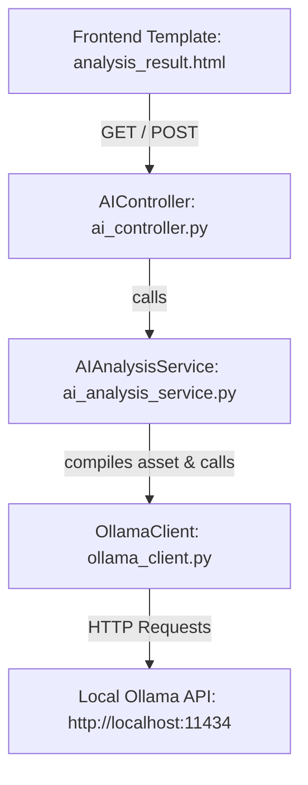

# Ollama Configuration

This document outlines the setup, architecture, and integration of the local **Ollama** AI service within the Helios application. The system leverages Ollama as a local AI copilot to analyze information assets, evaluate security coherence, and recommend security controls from the ISO 27002 catalog.

---

## 1. System Architecture

The Ollama integration is split into three main layers within the `app_core` service:



### Components:
- **`OllamaClient`** (`app/services/ollama_client.py`): Communicates directly with the Ollama local HTTP API. It handles server health checks, model list retrieval, raw prompts execution, and basic text parsing.
- **`AIAnalysisService`** (`app/services/ai_analysis_service.py`): Prepares asset-specific data structures (including CID ratings, inherent risk, residual risk, and ISO maturity scores) and converts them into structured prompts for the AI model.
- **`AIController`** (`app/controllers/ai_controller.py`): Defines routing for AI actions, handles status checks, and serves the results to the frontend Jinja2 templates.

---

## 2. Server Setup and Configuration

### Prerequisites
1. Download and install **Ollama** from the official website: [https://ollama.com](https://ollama.com).
2. The installation will run Ollama as a background service listening on `http://127.0.0.1:11434`.

### Pulling the Required Model
The Helios application is configured to use the **`llama3.2`** model by default. Pull this model from your terminal before starting the application:

```powershell
# Pull the default llama3.2 model to run locally
ollama pull llama3.2
```

### Exposing Ollama (WSL/Docker/Local Network)
If the application needs to run in a different environment or container and access the host machine's Ollama instance, configure the host binding:

1. **Windows Configuration:**
   - Search for **"Environment Variables"** in Windows Settings.
   - Add a new User or System Variable:
     - **Variable name:** `OLLAMA_HOST`
     - **Variable value:** `0.0.0.0:11434` *(Allows external requests to connect)*
   - Right-click the Ollama icon in the system tray, select **Quit**, and restart the Ollama application.

2. **Environment Variable in `.env`:**
   Configure the host and port in the `app_core/.env` file:
   ```ini
   # Ollama connection configuration
   OLLAMA_HOST=localhost
   OLLAMA_PORT=11434
   ```

---

## 3. Implementation Details

### Prompts & AI Directives
The prompt instructions guide the local LLM to behave as an Information Security and Risk Management expert.

#### System Prompt:
```text
Eres un experto en seguridad de la información y gestión de riesgos. Analiza el activo proporcionado y proporciona:
1. Observaciones de coherencia (¿tiene el activo medidas de seguridad apropiadas para su valor?)
2. Recomendaciones de controles ISO 27002 que deberían implementarse
Sé conciso y práctico en tus recomendaciones.
```

#### User Prompt:
```text
Analiza el siguiente activo de información:

Nombre: [Asset Name]
Tipo: [Asset Type]
Descripción: [Asset Description]

Valoración CID:
- Confidencialidad: [C]/5
- Integridad: [I]/5
- Disponibilidad: [A]/5
- Valor Total (V_total): [V_total]

Riesgo Inherente: [Inherent Risk]
Riesgo Residual: [Residual Risk]
Madurez actual: [Maturity %]

Proporciona:
1. Observaciones de coherencia (2-3 puntos)
2. Controles ISO 27002 recomendados (3-5 controles)
```

---

## 4. Response Parsing
To ensure the LLM responses are seamlessly structured inside the Jinja2 templates, the `OllamaClient` parses the plain-text markdown response:

- **Observations Extractions:** Looks for sections containing words like `observación` or `coherencia` and extracts numbered or bulleted lines.
- **Recommendations Extractions:** Identifies paragraphs referencing `recomendación` or `control` (filtering by common ISO control prefixes like `A.5`, `A.6`, `A.8`, etc.).

---

## 5. Troubleshooting and Availability Checks

To prevent application crashes when Ollama is offline or unavailable:
- **`is_available()` check:** Performed prior to executing analysis via `AIAnalysisService.is_available()`, routing fallback messages cleanly to the UI.
- **Connection timeouts:** The request timeout is set to `60` seconds for text generation to allow slower local CPUs to process requests without freezing the application.
